# Notes de cours sur Docker et Kubernetes 

## Section 1 

Installation et défnition des termes

## Section 2 

docker run "image name"

exemple : 

    docker run hello-world

docker run "image name" command
	
exemple : 

    docker run busybox echo hi there

docker ps

docker ps --all

docker run = docker create + docker start
	
exemple : 

	docker create hello-word, retourne l'id du conteneur, 

    docker start "id du conteneur" "param"  

Si un conteneur n’est plus lancé, on peut le relancer avec la commande docker start -a "id du conteneur". 
Le paramètre -a permet d’attacher la console.

docker logs "conteneur id"

exemple :

    $ docker run busybox echo hello world

    $ docker ps --all

    CONTAINER ID   IMAGE                                                 COMMAND                  CREATED          STATUS                            PORTS                        NAMES
    f09b716cc75e   busybox                                               "echo hello world"       37 seconds ago   Exited (0) 37 seconds ago                                      elastic_grothendieck

    $ docker start -a f09b716cc75e

    hello world

    $ docker logs f09b716cc75e

    hello world
    hello world

docker prune : supprime tous les conteneurs non utilisés.

docker stop "conteneur id" donne une chance des processus de se terminer correctement, contrairement à kill.

docker kill "conteneur id"

exemple du lancement d’un conteneur :

    $ docker run redis

connexion au cli de ce conteneur. 

    $ docker ps
    CONTAINER ID   IMAGE     COMMAND                  CREATED          STATUS          PORTS      NAMES
    eb98dee4e033   redis     "docker-entrypoint.s…"   17 minutes ago   Up 17 minutes   6379/tcp   stoic_pike

    $ docker exec -it eb98dee4e033 redis-cli  (les paramètres -it permettent d’ouvrir un terminal interactif)
    127.0.0.1:6379> 

pour ouvrir un promp on lance bash :

    $ docker exec -it eb98dee4e033 bash
    
    $ docker run -it busybox sh

## Section 3

Dockerfile utilisé pour la démonstration :
    
    # image de base à utiliser
    FROM alpine

    # installation des dépendances
    RUN apk add --udpate redis

    # processus à lancer au démarrage
    CMD ["redis-server"]

Lancement de la création du conteneur :

    $ docker build -t mon-conteneur-redis .

    $ docker run -d mon-conteneur-redis
	
-d (detached mode) → Exécute le conteneur en arrière-plan, sans bloquer le terminal.

À chaque étape du dockerfile, un snapshot de l’image temporaire est fait et gardé en cache. 

Récupérer une image et la construire : 

    docker build -t <docker id>/<image id>:<version id> 

Le paramètre -t sert à tagger l’image avec un nom.

Pour récupérer une image

    docker pull nginx
	
Tager une image. Par exemple je lance un « docker build . -t my_redis » sur mon fichier Dockerfile
	
Ensuite on peut la lancer avec « docker run my_redis »
	
Si on ne l’a pas fait pendant le build, on peut appeler « docker tag "conteneur id" "tag" » 	

docker commit est utilisé pour créer une nouvelle image Docker à partir d'un conteneur existant :

> on ouvre un premier terminal :

   	% docker run -it alpine sh
	# touch hello
	
> on ouvre un second terminal : 	
	
    % docker ps
	CONTAINER ID   IMAGE       COMMAND          CREATED          STATUS          PORTS     NAMES
	464774476c4b   alpine      "sh"             59 seconds ago   Up 58 seconds             stoic_panini
	
	% docker commit -c 'CMD ["sh"]' 464774476c4b
	
	% docker tag 23de88a5dbe540deeee my_alpine
	
	% docker run -it my_alpine
	
	# ls
	bin    dev    etc    hello …

Différence entre tag et commit ? 

docker tag a pour objectif de créer un alias ou une nouvelle référence pour une image Docker existante.

	docker tag myapp:1.0 myapp:latest

docker commit a pour objectif de créer une nouvelle image à partir d'un conteneur en cours d'exécution.
    
    docker commit mycontainer myapp:v2

En résumé, docker tag est utilisé pour gérer les noms et les tags des images, tandis que docker commit est utilisé pour créer de nouvelles images à partir de conteneurs modifiés.

## Section 4 : real project

Create a web application with nodejs : 

	FROM node:14-alpine

	WORKDIR /usr/app

	COPY ./package.json ./
	RUN npm install
	COPY ./ ./

	CMD ["npm", "start"]

Pour lancer le conteneur :

    % docker build .

    % docker run -p 8080:8080 <image id>

Pour éventuelle y accéder depuis le terminal :

    % docker ps

    CONTAINER ID   IMAGE          COMMAND                  CREATED              STATUS              PORTS                    NAMES
    ac2aea5cbca0   2f7e044fbad9   "docker-entrypoint.s…"   About a minute ago   Up About a minute   0.0.0.0:8080->8080/tcp   quirky_pascal

    % docker exec -it ac2aea5cbca0 sh

    /usr/app # ls
    Dockerfile         index.js           node_modules       package-lock.json  package.json

Au cas où les fichiers sont modifiés, il faut relancer un build du conteneur.

## section 5 : docker-compose
 
docker-compose

La configuration se fait dans le fichier docker-compose.yml

 * redis-server : utilise l’image redis
 * node-app : démarrage le serveur nodejs et map port 8081 to 8081
 
docker-compose.yml
 
    version: '3'
    services:
                    redis-server:
                                    image: 'redis'
                    node-app:
                                    restart: always
                                    build: .
                                    ports:
                                                    - "4001:8081"
 
restart policies :

* « no » : never
* always 
* on-failure : si le code de retour du processus est un code d’erreur
* unless-stopped : redémarre toujours sauf si c’est l’administrateur qui l’a arrêté
 
on lance ensuite la commande :
                
    $ docker-compose up
                
Le paramètre --build permet de forcer la reconstruction des images des services.
 
    $ docker-compose ps

## section 6 : workflow

Un workflow typique : 

* GitHub Repo
* Pull Request de la branche feature à la master
* Master branch 
* Travis CI 
* AWS Hosting

Les branches dans la repository : 

* feature branche (dévelopement)
* master branche (test l'intégration des composants)

Pour illustrer cela, on récupère une application nodejs.

On installe nodejs et on lance "npm install" dans le répertoire contenant le fichier "package.json".

On démarre l'application avec :

    $ npm run start
    
Et le navigateur s'ouvre sur la page "http://localhost:3000/".

Il est conseillé de créer un fichier docker pour le développement et un autre pour la production.

Dockerfile.dev

    FROM node:lts-alpine
    
    WORKDIR '/app'
    
    COPY package.json .
    RUN npm install
    
    COPY . .
    
    CMD ["npm","run","start"]

On exécute ensuite la construction de l'image : 

    % docker build -f Dockerfile.dev .
    
On démarre ensuite un conteneur : 

    % docker run -p 3000:3000 <conteneur id>

Mais le problèmes qu'on remarque maintenant est qu'il n'est pas possible de travailler avec le code source car il est copié dans le conteneur.

Il n'y a plus moyen d'y accéder directement pour les modifier.
    
On utilise des volumes pour partager des répertoires locaux avec les conteneurs : 

    % docker run -p 3000:3000 -v /app/node_modules -v $(pwd):/app <conteneur id>

On remarque particulièrement -v /app/node_modules qui est un volume anonyme.

Les volumes anonymes dans Docker sont une fonctionnalité qui permet de stocker des données de manière persistante, mais sans lier explicitement ces données à un répertoire spécifique sur l'hôte.

Pour cela, la syntaxe docker-compose est plus simple: 

    version: '3'
    services:
      web:
        build:
          context: .
          dockerfile: Dockerfile.dev
        ports:
        - "3000:3000"
        volumes:
        - /app/modules
        - .:/app

docker attach permet de récupérer le terminal sur un conteneur : 

    $ docker ps
    $ docker attach <container id>

Pour se détacher il faut faire CTRL+P puis CTRL+Q.

On a ensuite préparé un fichier docker pour l'environnement de production :

    FROM node:18-alpine as builder
    WORKDIR '/app'
    COPY package.json .
    RUN npm install
    COPY . .
    RUN npm run build
    
    FROM nginx
    COPY --from=builder /app/build /usr/share/nginx/html

L'approche multi-étapes dans un Dockerfile permet de créer des images Docker plus efficaces et optimisées en divisant le processus de construction en plusieurs étapes. 

Chaque étape peut utiliser une image de base différente et produire des artefacts qui sont ensuite utilisés dans les étapes suivantes. 

Dans notre cas on construit l'application avec l'image node, puis on utilise une autre image pour livrer l'environnement de production.

On lance la création de l'image et on la lance :

    % docker build .

     % docker run -p 8080:80 sha256:a95b499dccf2d7066aa6f67c09d7ab4507572193cba3faa7bf86a547d3c7edf8

## section 7 : intégration continue et déploiement sur AWS

Le code va être mis sur GitHub, avec un déclancheur vers GitHub Actions afin de construire l'image.

Le fichier de configuration du pipeline est [.github/workflows/main.yml](https://github.com/jibe77/udemy_docker_kubernetes/blob/main/.github/workflows/main.yml).

Il indique la liste des commandes à lancer.

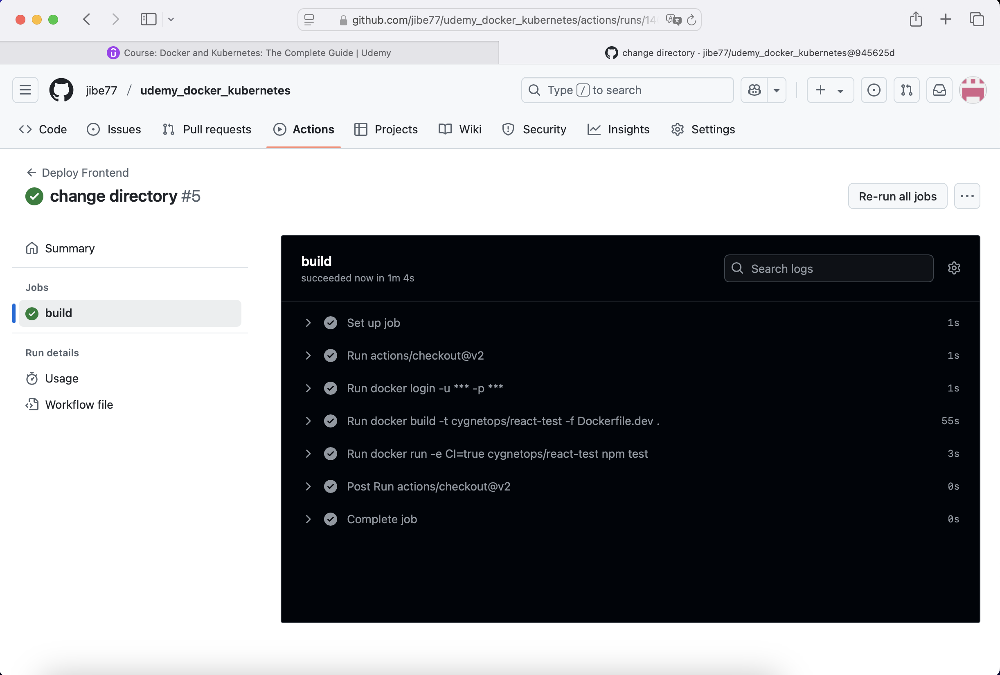

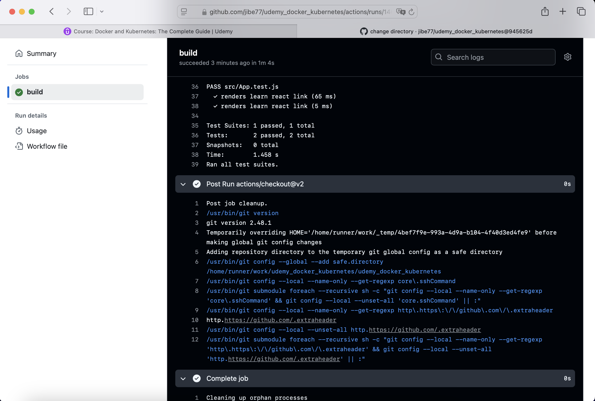

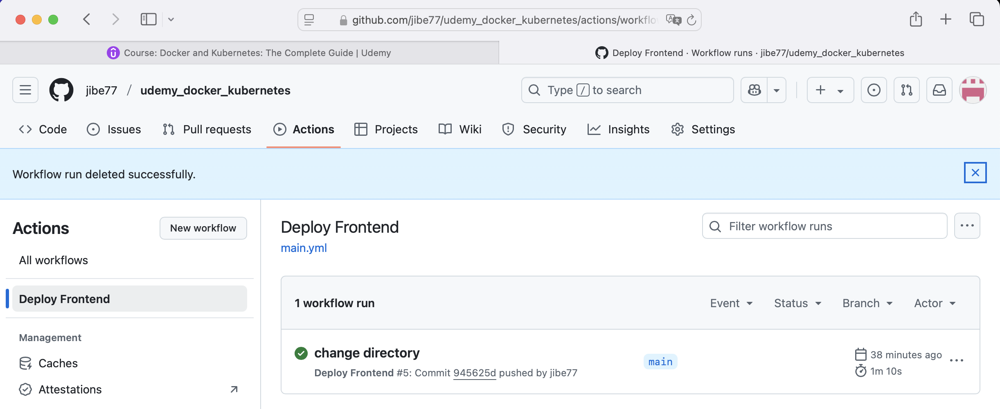

Le cours explique la création de l'environnement AWS. Ici le S3 Bucket pour déposer les fichiers : 

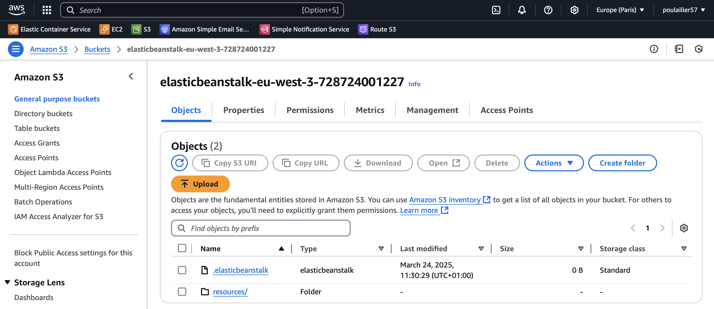 

Ici l'environnement elastic beanstalk :

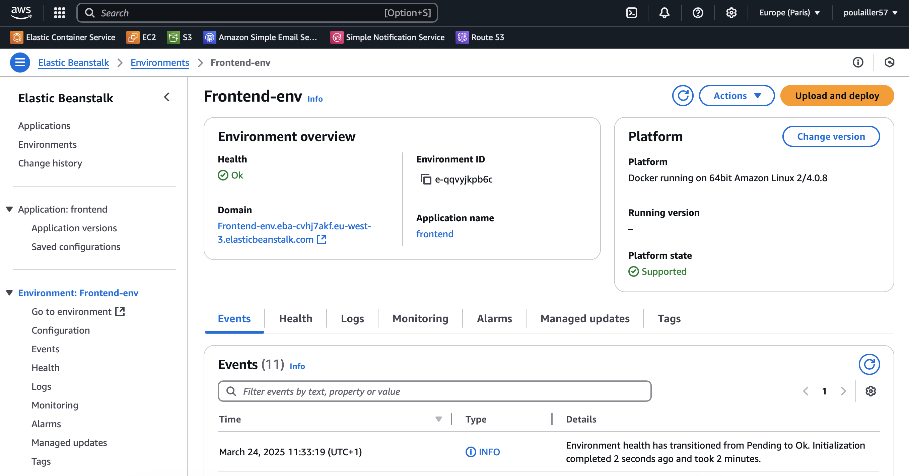

Ici la configuration de l'accès afin de permettre au script sur GitHub d'accéder à l'environnement AWS :

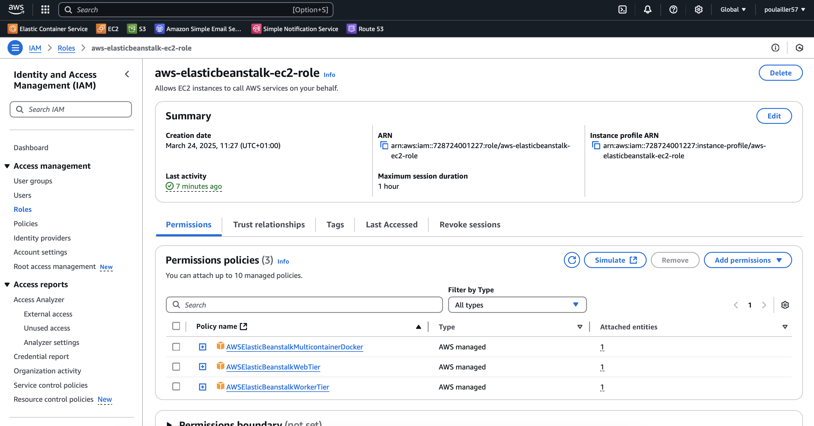

L'environnement créé se présente sous cette forme : 

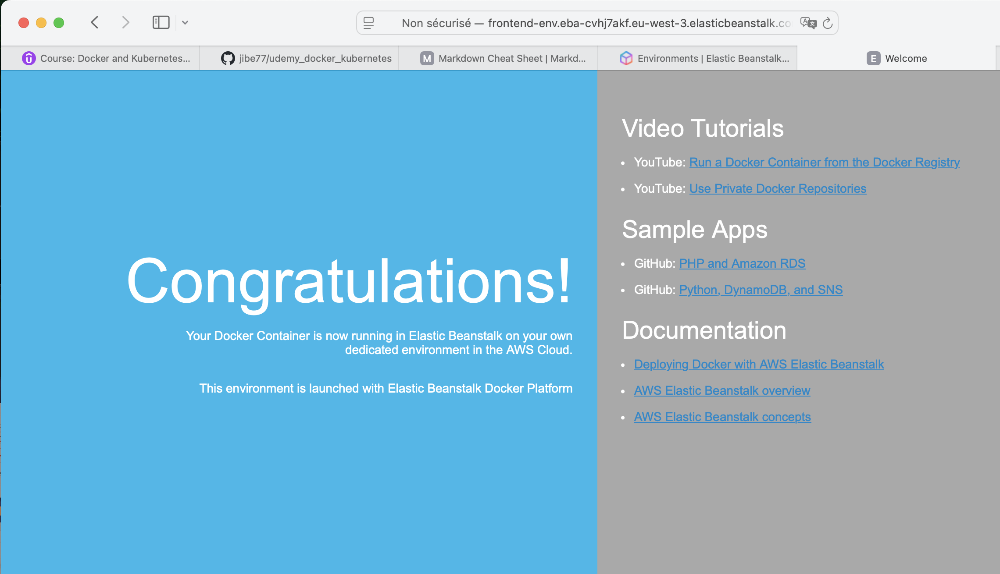 

Les identifiants pour accéder à DockerHub et AWS depuis le script GitHub sont enregistrés dans ces variables d'environnement : 

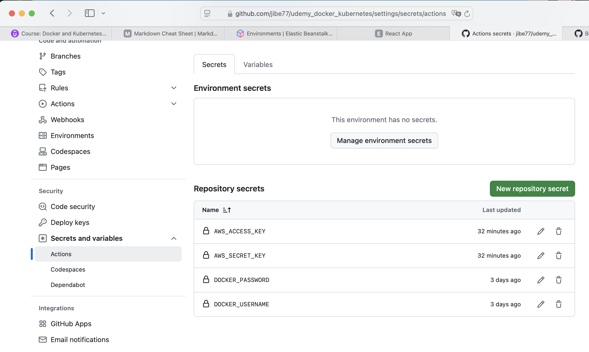

Dès qu'un push est fait vers GitHub, le script se lance afin de déployer la nouvelle version :

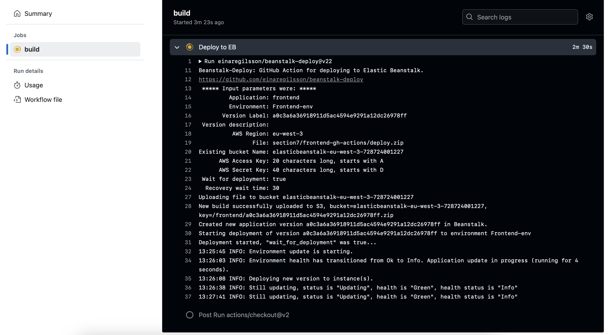

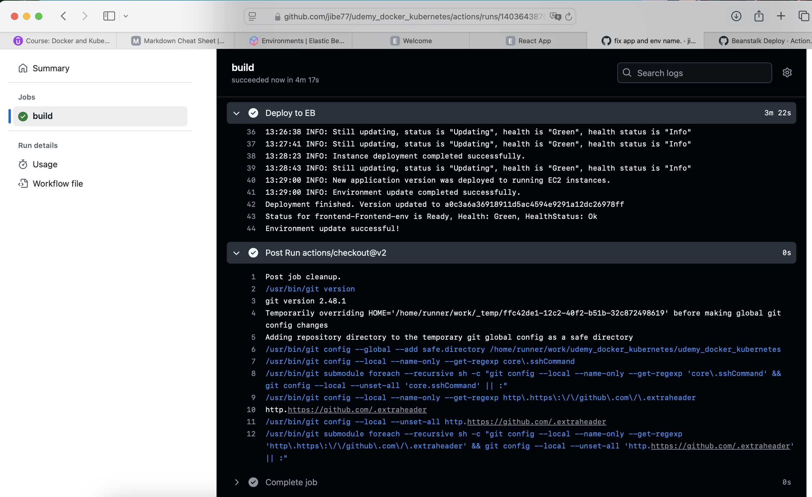

Voici l'application une fois qu'elle est déployée sur le Cloud AWS : 

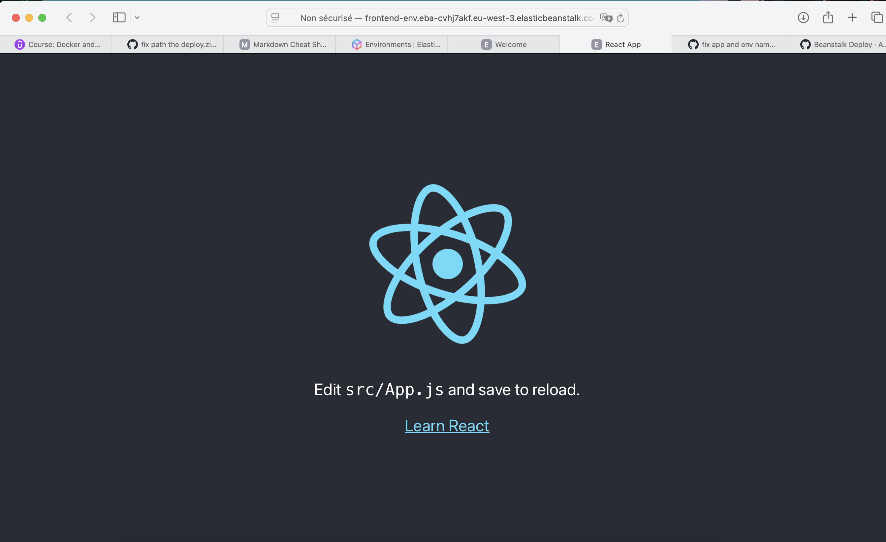

## section 9 : 

Cette section propose de mettre en place un environnement de développement et de production pour une application.

Celle-ci est basée sur un serveur NodeJS avec le framework Express ainsi que les bases de données Redis et PostgreSQL.

La partie cliente est basée sur React.

L'utilisation qui est faite de Docker est de créer des conteneurs afin de déployer efficacement chaque module de l'application.

- image du client : client/Dockerfile.dev

- image du serveur : server/Dockerfile.dev

- image du worker (simulation d'un service tier) : worker/Dockerfile.dev

L'orchestration est faite avec Docker-Compose afin de gérer l'exécution de ces conteneurs ainsi que le serveur nginx, 

et les bases de données : 

- docker-compose.yml

La commande suivante permet donc de déployer l'infrastructure complète : 

    % docker-compose up --build

La copie d'écran suivante montre le lancement l'application dans le terminal :

TODO : image 13 : build

TODO : image 14 : run

La copie d'écran suivante montre l'application en fonctionnement : 

TODO : image 12
