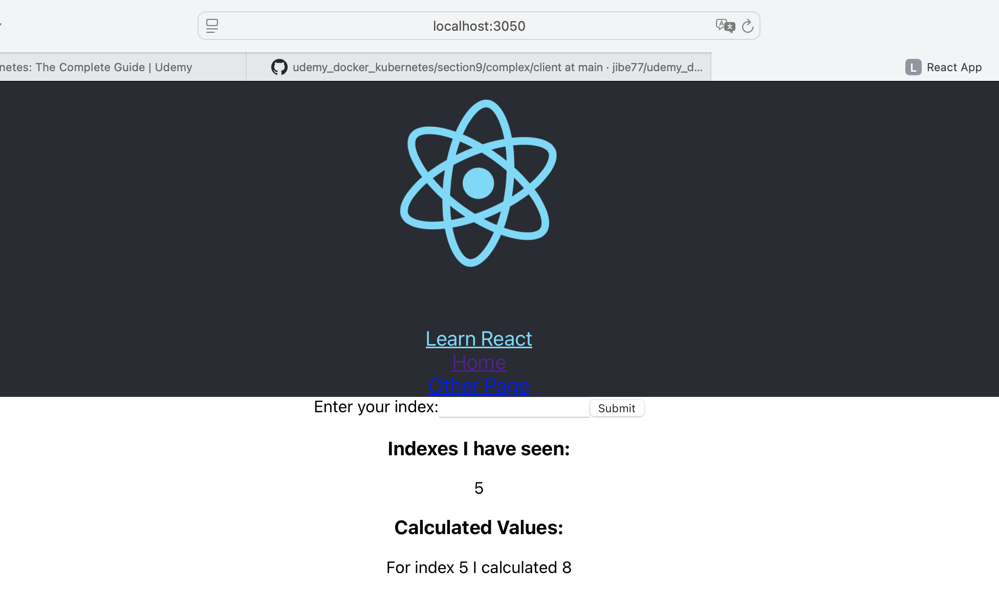
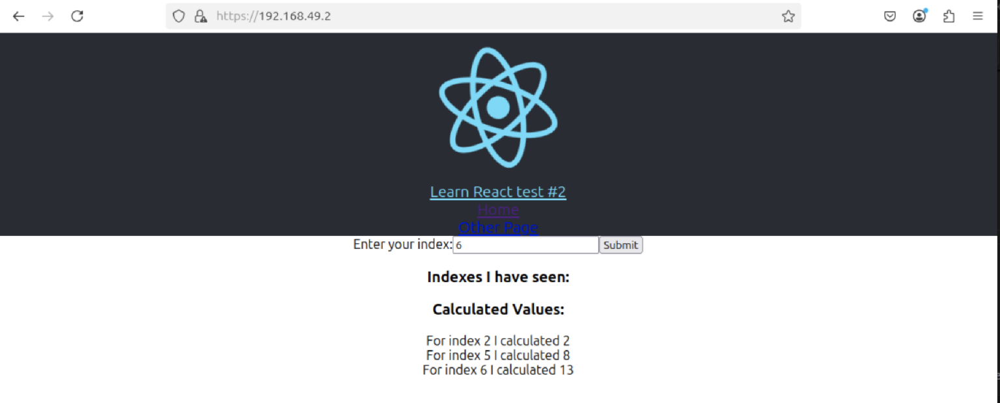

# Notes de cours sur Docker et Kubernetes 

## Section 1 

Installation et défnition des termes

## Section 2 

docker run "image name"

exemple : 

    docker run hello-world

docker run "image name" command
	
exemple : 

    docker run busybox echo hi there

docker ps

docker ps --all

docker run = docker create + docker start
	
exemple : 

	docker create hello-word, retourne l'id du conteneur, 

    docker start "id du conteneur" "param"  

Si un conteneur n’est plus lancé, on peut le relancer avec la commande docker start -a "id du conteneur". 
Le paramètre -a permet d’attacher la console.

docker logs "conteneur id"

exemple :

    $ docker run busybox echo hello world

    $ docker ps --all

    CONTAINER ID   IMAGE                                                 COMMAND                  CREATED          STATUS                            PORTS                        NAMES
    f09b716cc75e   busybox                                               "echo hello world"       37 seconds ago   Exited (0) 37 seconds ago                                      elastic_grothendieck

    $ docker start -a f09b716cc75e

    hello world

    $ docker logs f09b716cc75e

    hello world
    hello world

docker prune : supprime tous les conteneurs non utilisés.

docker stop "conteneur id" donne une chance des processus de se terminer correctement, contrairement à kill.

docker kill "conteneur id"

exemple du lancement d’un conteneur :

    $ docker run redis

connexion au cli de ce conteneur. 

    $ docker ps
    CONTAINER ID   IMAGE     COMMAND                  CREATED          STATUS          PORTS      NAMES
    eb98dee4e033   redis     "docker-entrypoint.s…"   17 minutes ago   Up 17 minutes   6379/tcp   stoic_pike

    $ docker exec -it eb98dee4e033 redis-cli  (les paramètres -it permettent d’ouvrir un terminal interactif)
    127.0.0.1:6379> 

pour ouvrir un promp on lance bash :

    $ docker exec -it eb98dee4e033 bash
    
    $ docker run -it busybox sh

## Section 3

Dockerfile utilisé pour la démonstration :
    
    # image de base à utiliser
    FROM alpine

    # installation des dépendances
    RUN apk add --udpate redis

    # processus à lancer au démarrage
    CMD ["redis-server"]

Lancement de la création du conteneur :

    $ docker build -t mon-conteneur-redis .

    $ docker run -d mon-conteneur-redis
	
-d (detached mode) → Exécute le conteneur en arrière-plan, sans bloquer le terminal.

À chaque étape du dockerfile, un snapshot de l’image temporaire est fait et gardé en cache. 

Récupérer une image et la construire : 

    docker build -t <docker id>/<image id>:<version id> 

Le paramètre -t sert à tagger l’image avec un nom.

Pour récupérer une image

    docker pull nginx
	
Tager une image. Par exemple je lance un « docker build . -t my_redis » sur mon fichier Dockerfile
	
Ensuite on peut la lancer avec « docker run my_redis »
	
Si on ne l’a pas fait pendant le build, on peut appeler « docker tag "conteneur id" "tag" » 	

docker commit est utilisé pour créer une nouvelle image Docker à partir d'un conteneur existant :

> on ouvre un premier terminal :

   	% docker run -it alpine sh
	# touch hello
	
> on ouvre un second terminal : 	
	
    % docker ps
	CONTAINER ID   IMAGE       COMMAND          CREATED          STATUS          PORTS     NAMES
	464774476c4b   alpine      "sh"             59 seconds ago   Up 58 seconds             stoic_panini
	
	% docker commit -c 'CMD ["sh"]' 464774476c4b
	
	% docker tag 23de88a5dbe540deeee my_alpine
	
	% docker run -it my_alpine
	
	# ls
	bin    dev    etc    hello …

Différence entre tag et commit ? 

docker tag a pour objectif de créer un alias ou une nouvelle référence pour une image Docker existante.

	docker tag myapp:1.0 myapp:latest

docker commit a pour objectif de créer une nouvelle image à partir d'un conteneur en cours d'exécution.
    
    docker commit mycontainer myapp:v2

En résumé, docker tag est utilisé pour gérer les noms et les tags des images, tandis que docker commit est utilisé pour créer de nouvelles images à partir de conteneurs modifiés.

## Section 4 : real project

Create a web application with nodejs : 

	FROM node:14-alpine

	WORKDIR /usr/app

	COPY ./package.json ./
	RUN npm install
	COPY ./ ./

	CMD ["npm", "start"]

Pour lancer le conteneur :

    % docker build .

    % docker run -p 8080:8080 <image id>

Pour éventuelle y accéder depuis le terminal :

    % docker ps

    CONTAINER ID   IMAGE          COMMAND                  CREATED              STATUS              PORTS                    NAMES
    ac2aea5cbca0   2f7e044fbad9   "docker-entrypoint.s…"   About a minute ago   Up About a minute   0.0.0.0:8080->8080/tcp   quirky_pascal

    % docker exec -it ac2aea5cbca0 sh

    /usr/app # ls
    Dockerfile         index.js           node_modules       package-lock.json  package.json

Au cas où les fichiers sont modifiés, il faut relancer un build du conteneur.

## section 5 : docker-compose
 
docker-compose

La configuration se fait dans le fichier docker-compose.yml

 * redis-server : utilise l’image redis
 * node-app : démarrage le serveur nodejs et map port 8081 to 8081
 
docker-compose.yml
 
    version: '3'
    services:
                    redis-server:
                                    image: 'redis'
                    node-app:
                                    restart: always
                                    build: .
                                    ports:
                                                    - "4001:8081"
 
restart policies :

* « no » : never
* always 
* on-failure : si le code de retour du processus est un code d’erreur
* unless-stopped : redémarre toujours sauf si c’est l’administrateur qui l’a arrêté
 
on lance ensuite la commande :
                
    $ docker-compose up
                
Le paramètre --build permet de forcer la reconstruction des images des services.
 
    $ docker-compose ps

## section 6 : workflow

Un workflow typique : 

* GitHub Repo
* Pull Request de la branche feature à la master
* Master branch 
* Travis CI 
* AWS Hosting

Les branches dans la repository : 

* feature branche (dévelopement)
* master branche (test l'intégration des composants)

Pour illustrer cela, on récupère une application nodejs.

On installe nodejs et on lance "npm install" dans le répertoire contenant le fichier "package.json".

On démarre l'application avec :

    $ npm run start
    
Et le navigateur s'ouvre sur la page "http://localhost:3000/".

Il est conseillé de créer un fichier docker pour le développement et un autre pour la production.

Dockerfile.dev

    FROM node:lts-alpine
    
    WORKDIR '/app'
    
    COPY package.json .
    RUN npm install
    
    COPY . .
    
    CMD ["npm","run","start"]

On exécute ensuite la construction de l'image : 

    % docker build -f Dockerfile.dev .
    
On démarre ensuite un conteneur : 

    % docker run -p 3000:3000 <conteneur id>

Mais le problèmes qu'on remarque maintenant est qu'il n'est pas possible de travailler avec le code source car il est copié dans le conteneur.

Il n'y a plus moyen d'y accéder directement pour les modifier.
    
On utilise des volumes pour partager des répertoires locaux avec les conteneurs : 

    % docker run -p 3000:3000 -v /app/node_modules -v $(pwd):/app <conteneur id>

On remarque particulièrement -v /app/node_modules qui est un volume anonyme.

Les volumes anonymes dans Docker sont une fonctionnalité qui permet de stocker des données de manière persistante, mais sans lier explicitement ces données à un répertoire spécifique sur l'hôte.

Pour cela, la syntaxe docker-compose est plus simple: 

    version: '3'
    services:
      web:
        build:
          context: .
          dockerfile: Dockerfile.dev
        ports:
        - "3000:3000"
        volumes:
        - /app/modules
        - .:/app

docker attach permet de récupérer le terminal sur un conteneur : 

    $ docker ps
    $ docker attach <container id>

Pour se détacher il faut faire CTRL+P puis CTRL+Q.

On a ensuite préparé un fichier docker pour l'environnement de production :

    FROM node:18-alpine as builder
    WORKDIR '/app'
    COPY package.json .
    RUN npm install
    COPY . .
    RUN npm run build
    
    FROM nginx
    COPY --from=builder /app/build /usr/share/nginx/html

L'approche multi-étapes dans un Dockerfile permet de créer des images Docker plus efficaces et optimisées en divisant le processus de construction en plusieurs étapes. 

Chaque étape peut utiliser une image de base différente et produire des artefacts qui sont ensuite utilisés dans les étapes suivantes. 

Dans notre cas on construit l'application avec l'image node, puis on utilise une autre image pour livrer l'environnement de production.

On lance la création de l'image et on la lance :

    % docker build .

     % docker run -p 8080:80 sha256:a95b499dccf2d7066aa6f67c09d7ab4507572193cba3faa7bf86a547d3c7edf8

## section 7 : intégration continue et déploiement sur AWS

Le code va être mis sur GitHub, avec un déclancheur vers GitHub Actions afin de construire l'image.

Le fichier de configuration du pipeline est [.github/workflows/main.yml](https://github.com/jibe77/udemy_docker_kubernetes/blob/main/.github/workflows/main.yml).

Il indique la liste des commandes à lancer.

Le cours explique la création de l'environnement AWS. Ici le S3 Bucket pour déposer les fichiers : 

 

Ici l'environnement elastic beanstalk :

Ici la configuration de l'accès afin de permettre au script sur GitHub d'accéder à l'environnement AWS :

L'environnement créé se présente sous cette forme : 

 

Les identifiants pour accéder à DockerHub et AWS depuis le script GitHub sont enregistrés dans ces variables d'environnement : 

Dès qu'un push est fait vers GitHub, le script se lance afin de déployer la nouvelle version :

Voici l'application une fois qu'elle est déployée sur le Cloud AWS : 

## section 9 : 

Cette section propose de mettre en place un environnement de développement pour une application.

Celle-ci est basée sur un serveur NodeJS avec le framework Express ainsi que les bases de données Redis et PostgreSQL.

La partie cliente est basée sur React.

L'utilisation qui est faite de Docker est de créer des conteneurs afin de déployer efficacement chaque module de l'application.

- image du client : [client/Dockerfile.dev](https://github.com/jibe77/udemy_docker_kubernetes/blob/main/section09/complex/client/Dockerfile.dev)

- image du serveur : [server/Dockerfile.dev](https://github.com/jibe77/udemy_docker_kubernetes/blob/main/section09/complex/server/Dockerfile.dev)

- image du worker (simulation d'un service tier) : [worker/Dockerfile.dev](https://github.com/jibe77/udemy_docker_kubernetes/blob/main/section09/complex/worker/Dockerfile.dev)

L'orchestration est faite avec Docker-Compose afin de gérer l'exécution de ces conteneurs ainsi que le serveur nginx, 

et les bases de données : 

- docker-compose.yml

La commande suivante permet donc de déployer l'infrastructure complète : 

    % docker-compose up --build

La copie d'écran suivante montre le lancement l'application dans le terminal :

La copie d'écran suivante montre l'application en fonctionnement : 

## section 10

Le cours continue la configuration Docker afin de préparer un environnement de production.

La principale modification qui nous intéresse, en lien direct avec le sujet, est la publication des images Docker sur Docker Hub.

Voici l'action GitHub qui est modifiée pour en scripter l'automatisation : 

Voici les images publiées sur mon compte DockerHub : 

Lien vers mon compte Docker Hub : https://hub.docker.com/repositories/jibe77

## Section 11 : déploiement sur AWS

Le déploiement se fait via un fichier de description de l'environnement.

Il réutilise des services d'AWS plutôt que d'instancier des conteneurs, comme Redis et PostgreSQL.

Le script [.github/workflows/main.yml](https://github.com/jibe77/udemy_docker_kubernetes/blob/main/.github/workflows/main.yml) a été modifié afin de déployer automatiquement depuis GitHub 

      build_section11:
        runs-on: ubuntu-latest
        defaults:
          run:
            working-directory: section11/complex
        steps:
          - uses: actions/checkout@v3
          - run: docker login -u ${{ secrets.DOCKER_USERNAME }} -p ${{ secrets.DOCKER_PASSWORD }}
          - run: docker build -t jibe77/react-test -f ./client/Dockerfile.dev ./client
          - run: docker run -e CI=true jibe77/react-test npm test
    
          - run: docker build -t jibe77/multi-client ./client
          - run: docker build -t jibe77/multi-nginx ./nginx
          - run: docker build -t jibe77/multi-server ./server
          - run: docker build -t jibe77/multi-worker ./worker
    
          - run: docker push jibe77/multi-client
          - run: docker push jibe77/multi-nginx
          - run: docker push jibe77/multi-server
          - run: docker push jibe77/multi-worker
    
          - name: Generate deployment package
            run: zip -r deploy.zip . -x '*.git*'
    
          - name: Deploy to EB
            uses: einaregilsson/beanstalk-deploy@v22
            with:
              aws_access_key: ${{ secrets.AWS_ACCESS_KEY }}
              aws_secret_key: ${{ secrets.AWS_SECRET_KEY }}
              application_name: multi-docker
              environment_name: Multi-docker-env
              existing_bucket_name: elasticbeanstalk-eu-west-3-728724001227
              region: eu-west-3
              version_label: ${{ github.sha }}
              deployment_package: section11/complex/deploy.zip

Le script de lancement de l'application sur l'environnement Beanstalk se situe ici : https://github.com/jibe77/udemy_docker_kubernetes/blob/main/section11/complex/.ebextensions/docker-compose.yml

l'application sur l'environnement AWS Elastic Beanstalk :

L'environnement est constitué notamment d'une base de donnée Postgre basé sur AWS RDS, et de Reddis basé sur ElastiCache :

Voici les instances Postgre et Reddis sur la console d'administration AWS : 

Voici l'environnement Elastic Beanstalk, qui est une solution PAAS : 

Voici une copie d'écran de l'application déployée : 

## Section 12 : création d'un environnement Kubernetes

J'ai eu des problèmes à lancer Kubernetes sur MacOS via Docket Desktop.

Je suis donc passé sur une machine virtuelle Ubuntu pour installer Minikube.

    $ minikube status

    minikube
    type: Control Plane
    host: Running
    kubelet: Running
    apiserver: Running
    kubeconfig: Configured

Pour appliquer un fichier de configuration :

    $ kubectl apply -f <filename>

On ajoute notre environnement : 

    $ kubectl apply -f client-pod.yaml  
    pod/client-pod created

    $ kubectl apply -f client-node-port.yaml 
    service/client-node-port created

On récupère l'état des pods (conteneurs) et des services (réseau) : 

    $ kubectl get pods
    NAME         READY   STATUS    RESTARTS   AGE
    client-pod   1/1     Running   0          6m10s

    $ kubectl get services
    NAME               TYPE        CLUSTER-IP       EXTERNAL-IP   PORT(S)          AGE
    client-node-port   NodePort    10.110.130.181   <none>        3050:31515/TCP   2m46s
    kubernetes         ClusterIP   10.96.0.1        <none>        443/TCP          63m

Quand on consulte l'environnement, il faut utiliser l'adresse IP utilisée par Minikube : 

    $ $ minikube ip
    192.168.49.2

On peut ensuite ouvrir l'application web via http://192.168.49.2:31515 comme on le voit sur cette copie d'écran : 

Le cours explique le fonctionnement déclaratif des fichiers de configuration. Les fichiers décrivent en effet l'architecture que l'on souhaite et k8s la met en place et prend en charge tout ce qu'il faut.

C'est différent d'un environnement impératif où l'on devrait déclarer les opérations à réaliser.

kubectl apply est une commande déclarative. Cela signifie que vous déclarez l'état final souhaité des ressources, et Kubernetes s'assure que le cluster reflète cet état. 

## Section 13 : Maintenance

Dans un premier temps, il est expliqué comment mettre à jour un Pod en modifiant le contenu de son fichier de configuration.

On modifie donc le fichier client-pod.yaml pour utiliser l'image multi-worker à la place de multi-client.

    image: stephengrider/multi-worker

On exécute ensuite la commande kubectl apply -f client-pod.yaml pour appliquer la modification.

    $ kubectl apply -f client-pod.yaml 
    pod/client-pod configured

    $ kubectl get pods
    NAME         READY   STATUS    RESTARTS      AGE
    client-pod   1/1     Running   3 (56s ago)   29h

    $ kubectl describe pod client-pod
    Name:             client-pod
    Namespace:        default
    Priority:         0
    Service Account:  default
    Node:             minikube/192.168.49.2
    Start Time:       Thu, 27 Mar 2025 17:42:46 +0100
    Labels:           component=web
    Annotations:      <none>
    Status:           Running
    IP:               10.244.0.8
    IPs:
    IP:  10.244.0.8
    Containers:
    client:
        Container ID:   docker://7c78cbfbebf2a5c837530e1079e33c3604571c394c092f62967bb4f81390e5c6
        Image:          stephengrider/multi-worker
        Image ID:       docker-pullable://stephengrider/multi-worker@sha256:5fbab5f86e6a4d499926349a5f0ec032c42e7f7450acc98b053791df26dc4d2b
        Port:           3000/TCP
        Host Port:      0/TCP
        State:          Running
        Started:      Fri, 28 Mar 2025 23:40:19 +0100
        Last State:     Terminated
        Reason:       Completed
        Exit Code:    0
        Started:      Thu, 27 Mar 2025 22:02:45 +0100
        Finished:     Fri, 28 Mar 2025 23:40:07 +0100
        Ready:          True
        Restart Count:  3
        Environment:    <none>
        Mounts:
        /var/run/secrets/kubernetes.io/serviceaccount from kube-api-access-r8lzj (ro)
    Conditions:
    Type                        Status
    PodReadyToStartContainers   True 
    Initialized                 True 
    Ready                       True 
    ContainersReady             True 
    PodScheduled                True 
    Volumes:
    kube-api-access-r8lzj:
        Type:                    Projected (a volume that contains injected data from multiple sources)
        TokenExpirationSeconds:  3607
        ConfigMapName:           kube-root-ca.crt
        ConfigMapOptional:       <nil>
        DownwardAPI:             true
    QoS Class:                   BestEffort
    Node-Selectors:              <none>
    Tolerations:                 node.kubernetes.io/not-ready:NoExecute op=Exists for 300s
                                node.kubernetes.io/unreachable:NoExecute op=Exists for 300s
    Events:
    Type    Reason   Age                  From     Message
    ----    ------   ----                 ----     -------
    Normal  Killing  4m10s                kubelet  Container client definition changed, will be restarted
    Normal  Pulling  4m10s                kubelet  Pulling image "stephengrider/multi-worker"
    Normal  Created  3m58s (x2 over 25h)  kubelet  Created container: client
    Normal  Started  3m58s (x2 over 25h)  kubelet  Started container client
    Normal  Pulled   3m58s                kubelet  Successfully pulled image "stephengrider/multi-worker" in 11.624s (11.624s including waiting). Image size: 79666111 bytes.

Par contre il n'est possible de tout changer à chaud. Pour faire cela, il faut utiliser un 'deployment' à la place d'un pod. Les 'deployments' sont conseillés pour une utilisation en prod, même s'ils sont adaptés pour les environnement de dev également.

Voici le fichier de configuration que l'on va utiliser pour notre 'deployment' : 

    apiVersion: v1
    kind: Deployment
    metadata:
    name: client-deployment
    spec:
        replicas: 1
        selector:
            matchLabels:
                component: web
        template:
            metadata:
                labels:
                    component: web
            spec:
                containers:
                    - name: client
                    image: stephengrider/multi-client
                    ports:
                        - containerPort: 3000

Avant de l'application on supprime le pod : 

    $ kubectl delete -f client-pod.yaml
    pod "client-pod" deleted

On peut ensuite appliquer le fichier : 

    $ kubectl apply -f client-deployment.yaml 
    deployment.apps/client-deployment created

    $ kubectl get deployments
    NAME                READY   UP-TO-DATE   AVAILABLE   AGE
    client-deployment   1/1     1            1           37s

    $ kubectl get pods
    NAME                                 READY   STATUS    RESTARTS   AGE
    client-deployment-648f484756-78x4d   1/1     Running   0          68s

En tapant cette commande on voit la configuration réseau interne du pod géré par le 'deployment' : 

    $ kubectl get pods -o wide
    NAME                                 READY   STATUS    RESTARTS   AGE     IP           NODE       NOMINATED NODE   READINESS GATES
    client-deployment-648f484756-78x4d   1/1     Running   0          4m18s   10.244.0.9   minikube   <none>           <none>

Le port 3000 et l'adresse IP ne sont utilisés qu'en interne, l'utilisateur de l'application n'y a pas accès.

Pour mettre à jour l'image des conteneur, il est conseillé de spécifier le numéro de version de ce dernier dans les fichiers de configuration k8s.

Il vaut mieux utiliser un numéro de version plutôt qu'un alias tel que "latest", car k8s ne va pas mettre à jour l'image s'il a déjà téléchargé la dernière image. En effet il ne va pas vérifier si c'est une nouvelle image vers laquelle latest pointe.

On peut mettre à jour la version des images à utiliser dans un 'deployment' en utilisant cette commande kubectl :

    $ kubectl set image deployment/client-deployment client=stephengrider/multi-client:v5

On peut configurer Docker CLI afin d'utiliser l'instance docker qui tourne dans Kubernetes :

    $ eval $(minikube docker-env)
    $ docker ps
    CONTAINER ID   IMAGE                        COMMAND                  CREATED        STATUS        PORTS     NAMES
    1c50c32e8505   stephengrider/multi-client   "nginx -g 'daemon of…"   24 hours ago   Up 24 hours             k8s_client_client-deployment-648f484756-78x4d_default_0a9f3919-6e09-49c6-8eb3-3c6470b7b160_0
    06ff3497b4b9   registry.k8s.io/pause:3.10   "/pause"                 24 hours ago   Up 24 hours             k8s_POD_client-deployment-648f484756-78x4d_default_0a9f3919-6e09-49c6-8eb3-3c6470b7b160_0
    58a442d4b1c8   6e38f40d628d                 "/storage-provisioner"   2 days ago     Up 2 days               k8s_storage-provisioner_storage-provisioner_kube-system_8adbf746-c4e8-4115-b7ee-071d4542e033_4
    4b976e83e08d   c69fa2e9cbf5                 "/coredns -conf /etc…"   2 days ago     Up 2 days               k8s_coredns_coredns-668d6bf9bc-mxdpc_kube-system_ffdc753a-21a5-4fc7-807f-0f37963ccf67_2
    8c9794b7d275   040f9f8aac8c                 "/usr/local/bin/kube…"   2 days ago     Up 2 days               k8s_kube-proxy_kube-proxy-jv9mj_kube-system_db866946-8b37-45cc-a05a-64e0b2b24eb6_2
    d49485857c9a   registry.k8s.io/pause:3.10   "/pause"                 2 days ago     Up 2 days               k8s_POD_coredns-668d6bf9bc-mxdpc_kube-system_ffdc753a-21a5-4fc7-807f-0f37963ccf67_2
    a34b7f5f2913   registry.k8s.io/pause:3.10   "/pause"                 2 days ago     Up 2 days               k8s_POD_kube-proxy-jv9mj_kube-system_db866946-8b37-45cc-a05a-64e0b2b24eb6_2
    cf22f5bec0f3   registry.k8s.io/pause:3.10   "/pause"                 2 days ago     Up 2 days               k8s_POD_storage-provisioner_kube-system_8adbf746-c4e8-4115-b7ee-071d4542e033_2
    3cf8a67a8b83   c2e17b8d0f4a                 "kube-apiserver --ad…"   2 days ago     Up 2 days               k8s_kube-apiserver_kube-apiserver-minikube_kube-system_d72d0a4cf4be077c9919d46b7358a5e8_2
    45a3a4c761d7   a389e107f4ff                 "kube-scheduler --au…"   2 days ago     Up 2 days               k8s_kube-scheduler_kube-scheduler-minikube_kube-system_d14ce008bee3a1f3bd7cf547688f9dfe_2
    a74987fc4683   a9e7e6b294ba                 "etcd --advertise-cl…"   2 days ago     Up 2 days               k8s_etcd_etcd-minikube_kube-system_2b4b75c2a289008e0b381891e9683040_2
    ebf583fd6fe8   8cab3d2a8bd0                 "kube-controller-man…"   2 days ago     Up 2 days               k8s_kube-controller-manager_kube-controller-manager-minikube_kube-system_843c74f7b3bc7d7040a05c31708a6a30_2
    8a900d7c0375   registry.k8s.io/pause:3.10   "/pause"                 2 days ago     Up 2 days               k8s_POD_kube-scheduler-minikube_kube-system_d14ce008bee3a1f3bd7cf547688f9dfe_2
    32a5f24f6b28   registry.k8s.io/pause:3.10   "/pause"                 2 days ago     Up 2 days               k8s_POD_kube-apiserver-minikube_kube-system_d72d0a4cf4be077c9919d46b7358a5e8_2
    f6843fe46f08   registry.k8s.io/pause:3.10   "/pause"                 2 days ago     Up 2 days               k8s_POD_etcd-minikube_kube-system_2b4b75c2a289008e0b381891e9683040_2
    9c0fc2da5c02   registry.k8s.io/pause:3.10   "/pause"                 2 days ago     Up 2 days               k8s_POD_kube-controller-manager-minikube_kube-system_843c74f7b3bc7d7040a05c31708a6a30_2

L'intéret est de pouvoir débugger le fonctionnement du master, par exemple : 

    $ docker log 9c0fc2da5c02

    $ docker exec -it 9c0fc2da5c02

Il y a des commandes avec kubectl pour accéder aux pods :

    $ kubectl get pods
    NAME                                 READY   STATUS    RESTARTS   AGE
    client-deployment-648f484756-78x4d   1/1     Running   0          24h

    jb@jb-VMware-Virtual-Platform:~/Documents/udemy_docker_kubernetes/section13/simplek8s$ kubectl logs client-deployment-648f484756-78x4d
    ls

    jb@jb-VMware-Virtual-Platform:~/Documents/udemy_docker_kubernetes/section13/simplek8s$ kubectl exec -it client-deployment-648f484756-78x4d -- sh
    # ls
    bin  boot  dev  etc  home  lib  lib64  media  mnt  opt  proc  root  run  sbin  srv  sys  tmp  usr  var

## section 14 : passage de l'application multi-conteneur à Kubernetes

On écrit un fichier de déploiement k8s.

On utilise un service ClusterIP lorsqu'il y a des communications entre les services internes.

Un service de type ClusterIP dans Kubernetes est utilisé pour exposer un ensemble de pods à l'intérieur d'un cluster.

Un service ClusterIP permet aux pods de communiquer entre eux au sein du même cluster. Il fournit une adresse IP stable et un nom DNS qui peuvent être utilisés par d'autres pods pour accéder aux services.

Stabilité : Les pods sont éphémères et peuvent être redémarrés, déplacés ou supprimés. Un service ClusterIP offre une couche d'abstraction qui permet de maintenir une adresse IP stable même si les pods sous-jacents changent.

Le service ClusterIP peut répartir le trafic entrant entre plusieurs pods, ce qui permet de distribuer la charge de travail et d'améliorer la disponibilité et la résilience des applications.

Les services ClusterIP ne sont accessibles qu'à l'intérieur du cluster, ce qui offre une couche supplémentaire de sécurité en limitant l'accès aux services uniquement aux composants internes du cluster.

On remarque que le deployment du worker n'a pas de Cluster IP car personne ne vient se connecter à lui. C'est ce composant qui va se connecter avec d'autres composants. Il n'est donc pas nécessaire de l'interfacer avec un Cluster IP.

Sur l'environnement de production, on a 11 composants à configurer. Il est possible de rassembler tout dans le même fichier de configuration mais c'est plus logique de les séparer dans des fichiers séparés.

On lance l'exécution de l'environnement configuré dans le répertoire k8s : 

    $ kubectl apply -f k8s
    service/client-cluster-ip-service configured
    deployment.apps/client-deployment unchanged
    service/client-cluster-ip-service configured
    deployment.apps/server-deployment unchanged
    deployment.apps/worker-deployment unchanged

On peut débugger le fonctionnement des pods, on voit ici qu'un serveur n'arrive pas à se connecter : 

    $ kubectl get pods
    NAME                                 READY   STATUS    RESTARTS   AGE
    client-deployment-648f484756-l2rz7   1/1     Running   0          33m
    client-deployment-648f484756-pdg6h   1/1     Running   0          33m
    client-deployment-648f484756-zjgkt   1/1     Running   0          33m
    server-deployment-78df9887cc-j44cm   1/1     Running   0          5m4s
    server-deployment-78df9887cc-nw5t7   1/1     Running   0          5m5s
    server-deployment-78df9887cc-xmr2w   1/1     Running   0          5m4s
    worker-deployment-6c877f9b66-cjfg4   1/1     Running   0          4m6s

    jb@jb-VMware-Virtual-Platform:~/Documents/udemy_docker_kubernetes/section14/complex-gh$ kubectl logs server-deployment-78df9887cc-j44cm

    > @ start /app
    > node index.js

    Listening
    { Error: connect ECONNREFUSED 127.0.0.1:5432
        at TCPConnectWrap.afterConnect [as oncomplete] (net.js:1161:14)
    errno: 'ECONNREFUSED',
    code: 'ECONNREFUSED',
    syscall: 'connect',
    address: '127.0.0.1',
    port: 5432 }

La configuration continue avec l'ensemble des objets, avec notamment l'utilisation des deux bases de données PostGreSQL et Reddis.

La configuration de PostGreSQL se base sur l'utilisation d'un volume persistant dans le fichier suivant : 

https://github.com/jibe77/udemy_docker_kubernetes/section14/complex-gh/k8s/database-persistent-volume-claim.yaml : 

    apiVersion: v1
    kind: PersistentVolumeClaim
    metadata:
    name: database-persistent-volume-claim
    spec:
    accessModes:
        - ReadWriteOnce
    resources:
        requests:
        storage: 2Gi

Il faut renseigner les mots de passe en utilisant une commande spéciale : 

    $ kubectl create secret generic pgpasswd --from-literal PGPASSWORD=12345asdf

    $ kubectl get secrets
    NAME       TYPE     DATA   AGE
    pgpasswd   Opaque   1      10s

Ce secret est récupéré dans l'objet du serveur : 

    env:
    - name: REDIS_HOST
        value: redis-cluster-ip-service
    - name: REDIS_PORT
        value: '6379'
    - name: PGUSER
        value: postgres
    - name: PGHOST
        value: postgres-cluster-ip-service
    - name: PGPORT
        value: '5432'
    - name: PGDATABASE
        value: postgres
    - name: PGPASSWORD
        valueFrom:
        secretKeyRef:
            name: pgpassword
            key: PGPASSWORD

De même dans le fichier de configuration de PostGres : 

    containers:
    - name: postgres
        image: postgres
        ports:
        - containerPort: 5432
        volumeMounts:
        - name: postgres-storage
            mountPath: /var/lib/postgresql/data
            subPath: postgres
        env:
        - name: POSTGRES_PASSWORD
            valueFrom:
            secretKeyRef:
                name: pgpassword
                key: PGPASSWORD

## section 15 : configuration du reverse-proxy et serveur web Ingress

On ajoute un fichier afin de configurer un objet pour le serveur Ingress.

Il sert à fournir une redirection des appels vers l'API pour le backend.

Il gère également les appels HTTP vers la partie cliente.

On peut ensuite intéroger l'application : 

    $ minikube addons enable ingress

    $ minikube ip
    192.168.49.2

Voici une copie d'écran :

On peut accéder au panneau de configuration de minikube avec la commande suivante :

    $ minikube dashboard

Cela ouvre le navigateur : 

